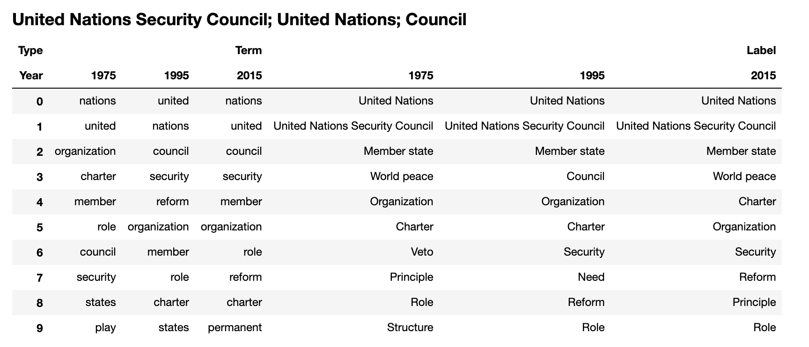

UN General Debates Analysis
===========================

This repo is a collection of experiments on the UN General Debate corpus. Speeches given at the General Debate of the UN General Assembly form a historical record of the issues that command the attention of the international community, and I am particularly interested in methods for studying the evolution of this changing narrative.

## Setup

The structure of this project is based on the <a target="_blank" href="https://drivendata.github.io/cookiecutter-data-science/">cookiecutter data science project template</a>.

### Environment

Create the environment with:

```
make create_environment
```

This will create a `virtualenv` or `conda` environment. Next, activate the environment. With `conda` (what I'm using) this is:

```
conda activate un-general-debates
```

Finally, install the requirements with the following command. Note that this uses `pip` behind the scenes. You may want to install some of the requirements manually. For example, `tensorflow` or `tensorflow-gpu` if you have a GPU available.
```
make requirements
```

### Data

There are two raw data files that are used in this project. They are:
* [General Debates](https://www.kaggle.com/unitednations/un-general-debates): This has all of the raw text and metadata from the speeches.
* [Country Code Mapping](https://www.kaggle.com/juanumusic/countries-iso-codes): This has a mapping from ISO Alpha-3 country codes to country names.

The following will download and preprocess them for you. If you haven't used the Kaggle API before, some additional setup will be required for this to work.

```
make data
```

Preprocessed data files are written to `data/processed/`.

## Topic Modelling

### LDA

The notebook `notebooks/LDA.ipynb` goes through an application of LDA on this data using `gensim`.

### Dynamic Topic Modelling

A [Dynamic Topic Model](https://mimno.infosci.cornell.edu/info6150/readings/dynamic_topic_models.pdf) is basically an extension of LDA to allow topic representations to evolve over fixed time intervals such as years. I wrote about applying this method to the General Debate corpus [here](https://towardsdatascience.com/exploring-the-un-general-debates-with-dynamic-topic-models-72dc0e307696). As an example, the model learned a topic about "Human Rights", and for this topic, a plot of probabilities over time for selected terms is shown below. Note the rising use of "woman" and "gender", the decline of "man", and the inverse relationship between "mankind" and "humankind".



This code uses `gensim`'s wrapper to the original C++ implementation to train DTMs. See the [docs](https://radimrehurek.com/gensim/models/wrappers/dtmmodel.html) for instructions on setup. You will need to either download a precompiled binary or build one manually.

To train a DTM on this dataset, refer to `scripts/train_dtm.py`. Note that the inference takes quite a while: almost 8 hours for me on a n1-standard-2 (2 vCPUs, 7.5 GB memory) instance on Google Cloud Platform. The script will save the model and a copy of the processed data into `models/`, and you can use the notebook `notebooks/DTM.ipynb` to explore the learned topics.
